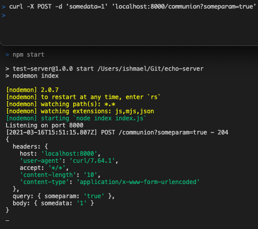

# Mock server

A web-server that logs requests and returns a configurable mocked response.

## Usage instructions

1. Rename `response-sample.json` to `response.json`
1. Run with `npm start`

This will launch a web server that listens for requests, logging the header, body, and query params, then responding with a fixed response, as configured in `response.json`.

Changes to files, including the response configuration, automatically reload the server.

The web-server listens on port 8000, or `PORT` from env.
